# Handwritten Multi-Digit Recognition with CNN–BiLSTM–CTC

[](https://www.python.org/)
[](https://www.tensorflow.org/)
[](https://jupyter.org/)


An OCR experiment for recognizing **multi-digit handwritten sequences** from images without requiring pre-segmentation of each individual digit.

The model combines convolutional visual features, bidirectional LSTMs, and **Connectionist Temporal Classification (CTC)** so the network can learn image-to-sequence alignment during training.

## Problem

Single-digit MNIST classification assumes each image contains exactly one isolated digit. Real OCR frequently receives a sequence of characters in one image. Segmenting each digit first can be brittle, especially when characters touch or spacing varies.

This project treats recognition as a sequence problem.

## Architecture

```mermaid
flowchart LR
    A[Handwritten sequence image] --> B[Resize / normalize]
    B --> C[CNN feature extraction]
    C --> D[Reshape to feature sequence]
    D --> E[Dense projection]
    E --> F[Bidirectional LSTM 128]
    F --> G[Bidirectional LSTM 64]
    G --> H[Character probabilities]
    H --> I[CTC loss / decoding]
    I --> J[Predicted digit string]
```



## Notebook configuration

| Item | Value in notebook |
|---|---|
| Image width | 140 |
| Image height | 28 |
| Maximum sequence length | 4 |
| Sequence model | 2 × bidirectional LSTM |
| Recurrent units | 128, then 64 |
| Training objective | CTC loss |
| Decoding | Keras CTC decode |

Labels are derived from image filenames, and `StringLookup` layers map between characters and numeric IDs.

## Why CTC?

CTC allows training on image-level text labels without providing the exact horizontal location of every character. It handles the many possible alignments between visual time steps and output characters and collapses them into the target sequence.

## Repository structure

```text
.
├── OCR -model.ipynb   # Data pipeline, CNN-BiLSTM-CTC model, training and decoding
├── .gitignore
├── .gitattributes
└── README.md
```

## Dataset expectations

The notebook expects images under a local `Hackathon_MNIST/` directory. Labels are extracted from each PNG filename.

The original dataset is **not included** in this repository.

## Typical dependencies

```text
tensorflow
numpy
pandas
matplotlib
```

Open [`OCR -model.ipynb`](OCR%20-model.ipynb), update the dataset path if necessary, and execute the cells in order.

## Evaluation status

The repository contains training and decoding logic but does not currently store a concise final benchmark report. No unsupported accuracy score is claimed here.

For sequence OCR, recommended metrics are:

- exact-sequence accuracy;
- character error rate (CER);
- edit distance;
- accuracy by sequence length;
- error analysis for touching/ambiguous digits.

## Limitations

- The original dataset is not versioned with the repository.
- Maximum sequence length is configured to four in the notebook.
- The project focuses on digits/characters present in the dataset vocabulary rather than general OCR.
- No production inference package or service is included.
- Robustness to rotation, blur, lighting, and different handwriting domains is not documented.

## Potential improvements

1. Add a synthetic data generator for reproducible examples.
2. Add augmentation for affine distortion, blur, noise, and variable spacing.
3. Record CER and exact-match metrics during validation.
4. Compare greedy CTC decoding with beam search.
5. Package preprocessing and inference into a simple CLI or API.
6. Evaluate on an external handwritten-number dataset to measure domain transfer.

## Skills demonstrated

OCR · sequence modeling · CTC · CNN · bidirectional LSTM · TensorFlow/Keras · data pipelines · image-to-text modeling

## License

No explicit open-source license is currently included. Unless a license is added, normal copyright rules apply to the repository contents.
